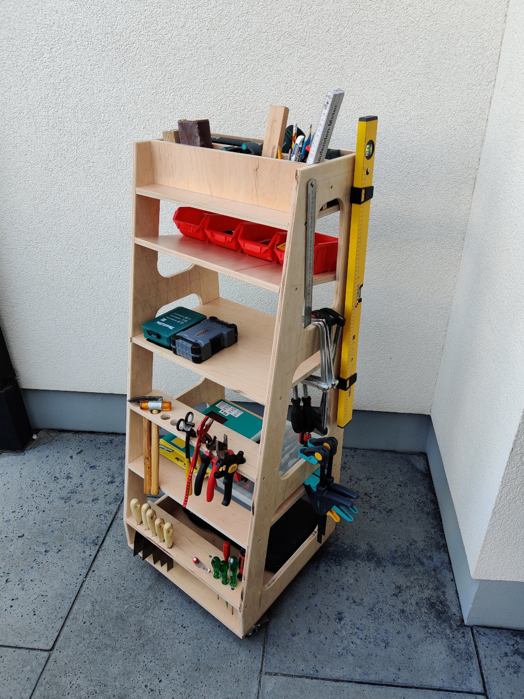
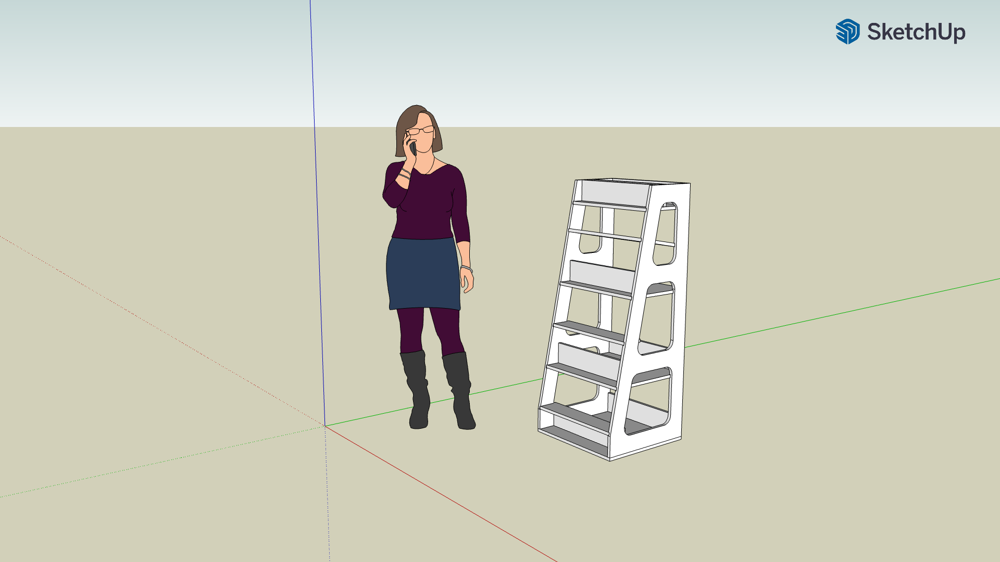
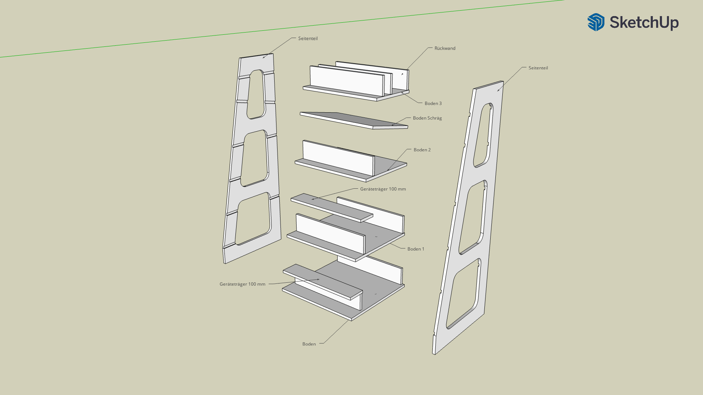
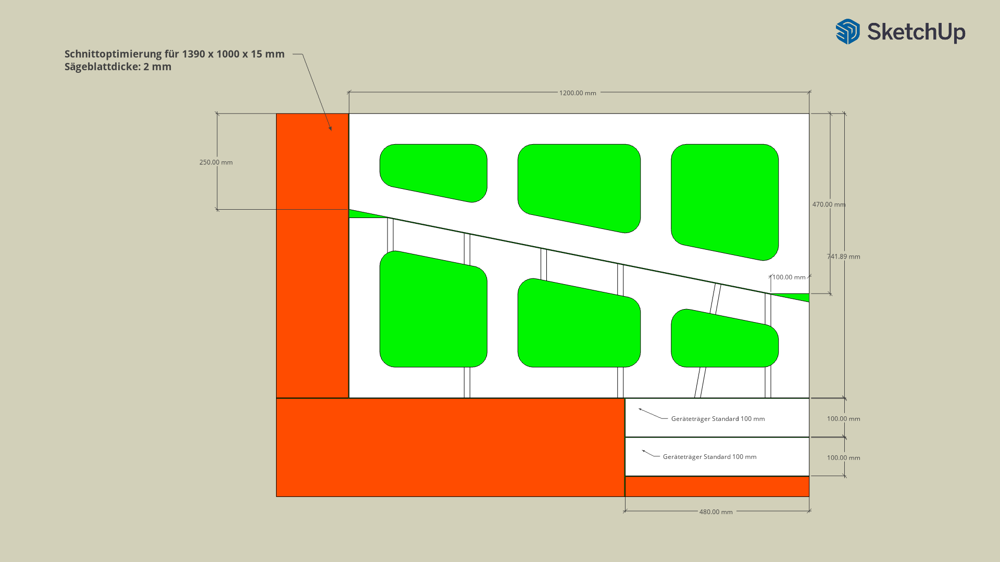
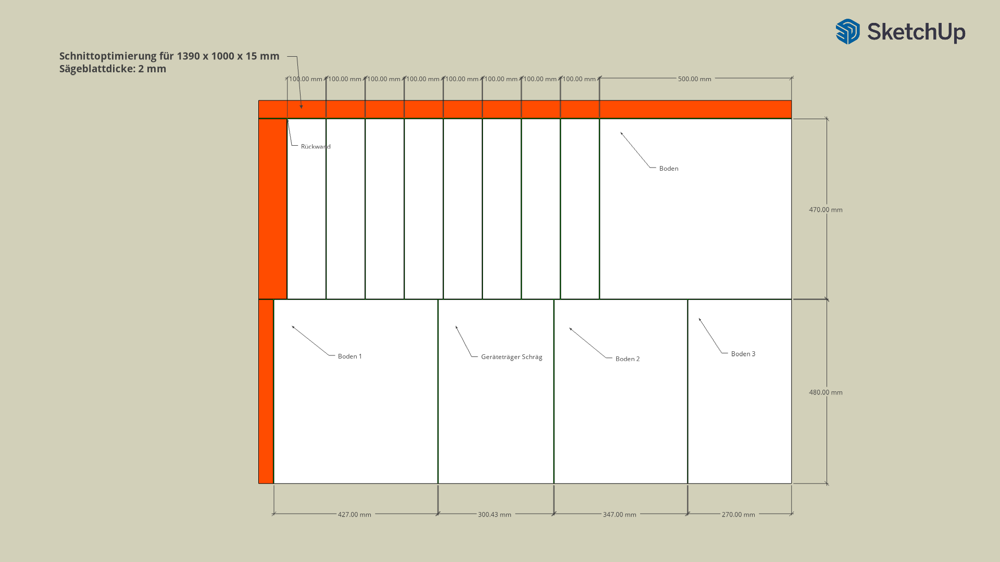
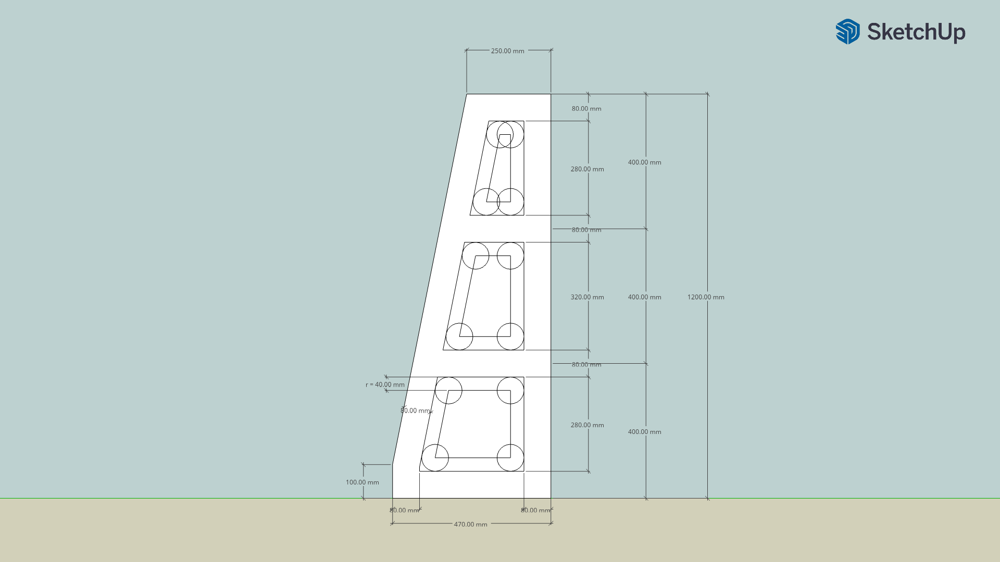
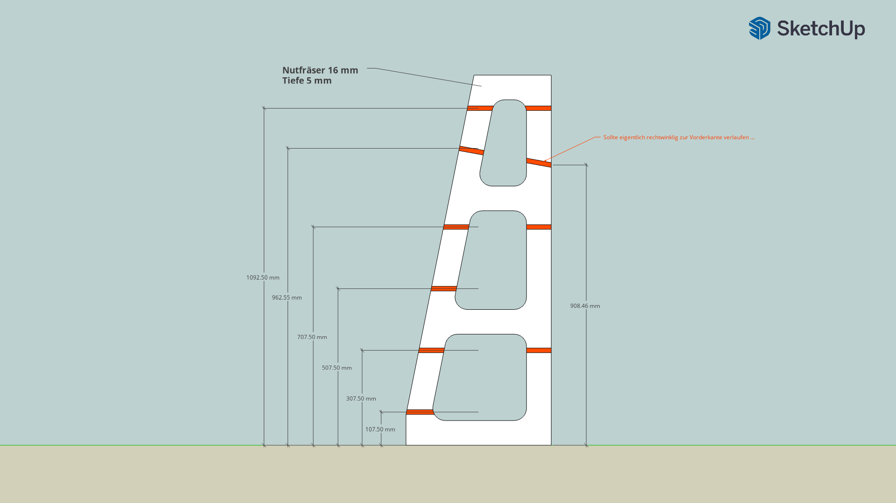

# Rollbares Werkzeugregal

[Inspiriert durch Adam Savage](https://www.youtube.com/watch?v=TWQAYfGxsPE)

## Material

* Multiplexplatten (1390 x 1000 x 15 mm) **2 x**
* Holzschrauben 30 mm **~ 60 x**
* Drehbare Rollen mit Bremsen **4 x**

## Werkzeug

* Kreis- oder Tauchsäge
* Stichsäge
* Akkuschrauber
    * Holzbohrer 3mm
    * Lochsäge 40 mm
    * Kreuz-Bit
* Oberfräse
    * Nutfräser 16 mm
    * Abrundfräser nach Geschmack
* Tischlerwinkel
* Zollstock ("Gliedermaßstab")
* Streichmaß (praktisch)
* ... Bleistift

# Schritte

## Übersicht

## Einzelteile

## Schnittoptimierung

## Griffmulden

## Fräsmaße

